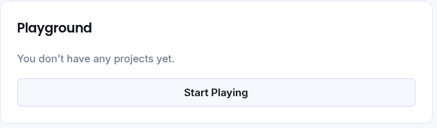
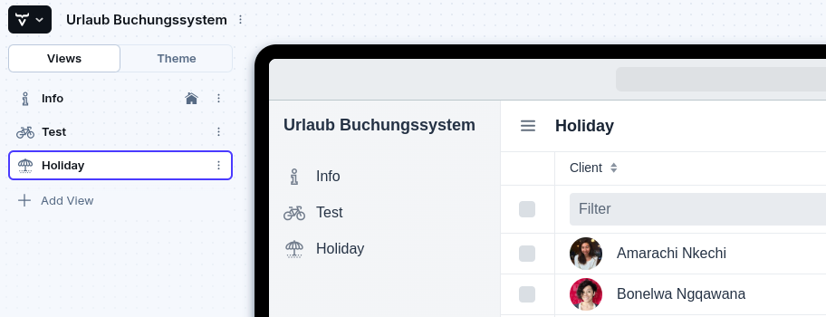
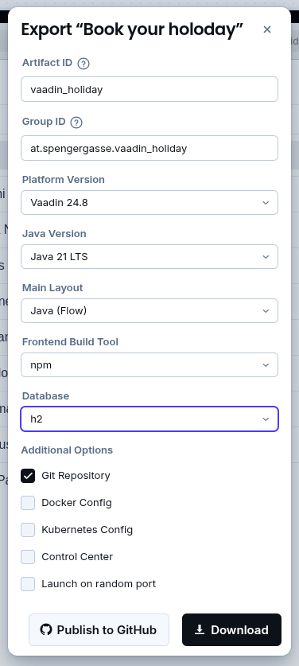
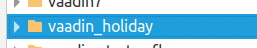
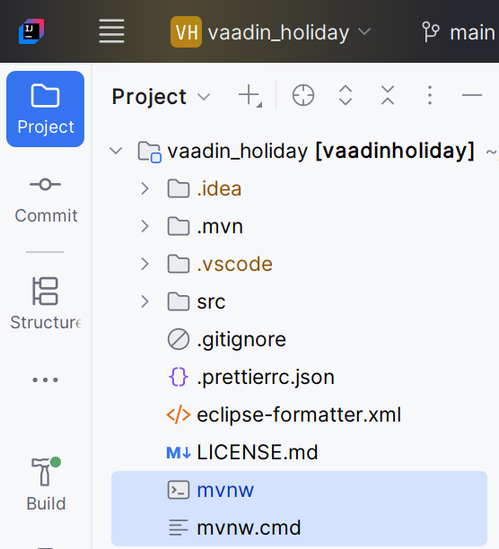
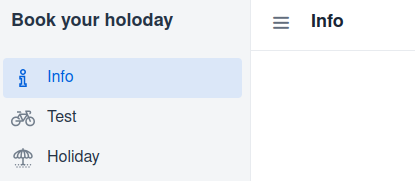

# Startup project

## Vaadin

Vaadin ist ein Java-Framework für die Entwicklung von modernen Webanwendungen.
Es erlaubt dir, mit Java (oder Kotlin) vollständige UI-Anwendungen zu bauen, ohne dass du dich direkt mit HTML, CSS oder JavaScript beschäftigen musst.

Server-Side UI Framework
- Die gesamte UI-Logik läuft auf dem Server (Java).
- Der Browser zeigt nur die gerenderte Oberfläche an, die Vaadin automatisch per WebSocket/HTTP aktualisiert.

Komponentenbasiert
- Du baust die Oberfläche mit fertigen Komponenten wie TextField, Grid, Button, DatePicker, usw. – ähnlich wie bei Swing/JavaFX, aber fürs Web.

Routing
- Jede View (Seite) ist eine Java-Klasse.
- Über @Route("zug") definierst du, unter welcher URL sie erreichbar ist.

Binder & Validation
- Mit Binder kannst du deine Formularfelder direkt an Java-Objekte (DTOs, Entities) binden.
- Unterstützt Bean Validation (@NotNull, @Min, @Pattern …).

Integration
- Funktioniert nahtlos mit Spring Boot.
- Kann auch standalone in einem Servlet-Container laufen (z. B. Tomcat, Jetty).

Modi
- Vaadin Flow: klassisches serverseitiges Java → UI wird automatisch gerendert.
- Vaadin Fusion (heißt jetzt Hilla): Kombination aus Java Backend + TypeScript Frontend.

## Create the application

https://start.vaadin.com/app?continue

<br/>Mit start playing gelangt man in den design mode
<br/>
<br/>Man muss dann die views definieren. Es können später auch im IntelliJ views hinzugefügt werden!
<br/>
<br/>Mit download wird dann das Projekt heruntergeladen.
<br/>
<br/>Nach dem Extrahieren wird daraus ein IntelliJ Projekt.
<br/>
<br/>Das Projekt dann öffnen und mit mvwn ausführen.
<br/>
<br/>Es öffnet sich der browser und das Projekt wird ausgeführt.
<br/>

# Layout

Open the project in an IDE. You can download the [IntelliJ community edition](https://www.jetbrains.com/idea/download) if you do not have a suitable IDE already.
Once opened in the IDE, locate the `Application` class and run the main method using "Debug".

For more information on installing in various IDEs, see [how to import Vaadin projects to different IDEs](https://vaadin.com/docs/latest/getting-started/import).

If you install the Vaadin plugin for IntelliJ, you should instead launch the `Application` class using "Debug using HotswapAgent" to see updates in the Java code immediately reflected in the browser.

## Deploying to Production

The project is a standard Maven project. To create a production build, call 

```
./mvnw clean package -Pproduction
```

If you have Maven globally installed, you can replace `./mvnw` with `mvn`.

This will build a JAR file with all the dependencies and front-end resources,ready to be run. The file can be found in the `target` folder after the build completes.
You then launch the application using 
```
java -jar target/vaadinholiday-1.0-SNAPSHOT.jar
```

## Project structure

- `MainLayout.java` in `src/main/java` contains the navigation setup (i.e., the
  side/top bar and the main menu). This setup uses
  [App Layout](https://vaadin.com/docs/components/app-layout).
- `views` package in `src/main/java` contains the server-side Java views of your application.
- `views` folder in `src/main/frontend` contains the client-side JavaScript views of your application.
- `themes` folder in `src/main/frontend` contains the custom CSS styles.

## Useful links

- Read the documentation at [vaadin.com/docs](https://vaadin.com/docs).
- Follow the tutorial at [vaadin.com/docs/latest/tutorial/overview](https://vaadin.com/docs/latest/tutorial/overview).
- Create new projects at [start.vaadin.com](https://start.vaadin.com/).
- Search UI components and their usage examples at [vaadin.com/docs/latest/components](https://vaadin.com/docs/latest/components).
- View use case applications that demonstrate Vaadin capabilities at [vaadin.com/examples-and-demos](https://vaadin.com/examples-and-demos).
- Build any UI without custom CSS by discovering Vaadin's set of [CSS utility classes](https://vaadin.com/docs/styling/lumo/utility-classes). 
- Find a collection of solutions to common use cases at [cookbook.vaadin.com](https://cookbook.vaadin.com/).
- Find add-ons at [vaadin.com/directory](https://vaadin.com/directory).
- Ask questions on [Stack Overflow](https://stackoverflow.com/questions/tagged/vaadin) or join our [Forum](https://vaadin.com/forum).
- Report issues, create pull requests in [GitHub](https://github.com/vaadin).
