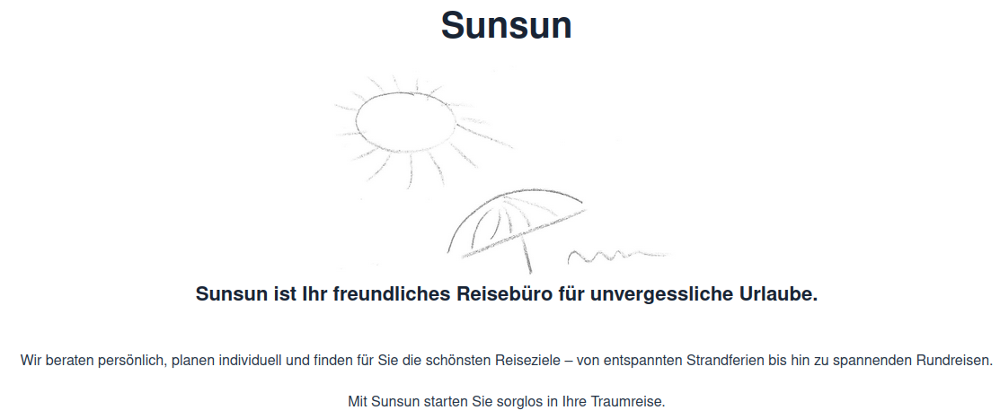
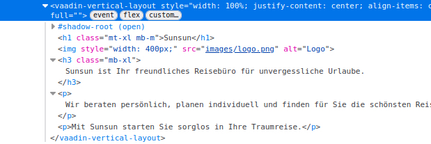

# Components

In Vaadin ist eine Component (Klasse com.vaadin.flow.component.Component) die Basisklasse für alle sichtbaren UI-Elemente.
Alles, was du im Browser siehst, basiert auf dieser Klasse.

Beispiele für Components
- Einfache Eingabefelder (TextField, PasswordField, TextArea, DatePicker)
- Buttons & Anzeigen (Button, Label, Notification)
- Layouts (VerticalLayout, HorizontalLayout, Grid)
- Komplexere Widgets (Grid, ComboBox, Upload, Dialog)

JavaDoc für Vaadin https://vaadin.com/docs/latest


```
public class InfoView extends VerticalLayout {
    public InfoView() {
        setSpacing(false);

        H1 header = new H1("Sunsun");
        header.addClassNames(Margin.Top.XLARGE, Margin.Bottom.MEDIUM);
        add(header);

        Image img = new Image("images/logo.png", "Logo");
        img.setWidth("400px");
        add(img);

        H3 info = new H3("Sunsun ist Ihr freundliches Reisebüro für unvergessliche Urlaube.");
        info.addClassNames(Margin.Bottom.XLARGE);
        add(info);
        add(new Paragraph("Wir beraten persönlich, planen individuell und finden für Sie die schönsten Reiseziele – von entspannten Strandferien bis hin zu spannenden Rundreisen."));
        add(new Paragraph("Mit Sunsun starten Sie sorglos in Ihre Traumreise."));

        setSizeFull();
        setJustifyContentMode(JustifyContentMode.CENTER);
        setDefaultHorizontalComponentAlignment(Alignment.CENTER);
        getStyle().set("text-align", "center");
    }
```

Browser
<br/>
<br/>HTML mit F12
<br/>
