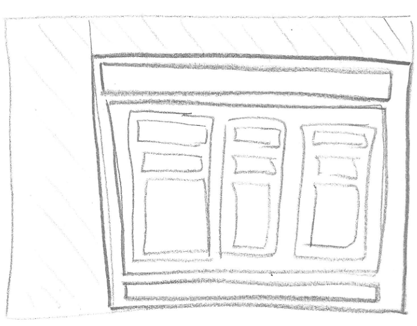
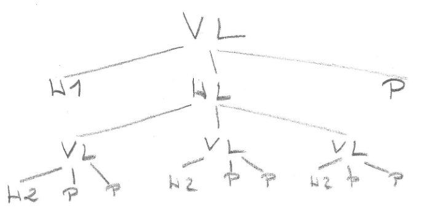

# Layouts

## VerticalLayout

- Ordnet Komponenten untereinander (von oben nach unten).
- Standardlayout in vielen Vaadin-Views.

```
VerticalLayout layout = new VerticalLayout();
layout.add(new Button("Erster Button"));
layout.add(new Button("Zweiter Button"));
```

## HorizontalLayout

- Ordnet Komponenten nebeneinander (von links nach rechts).

```
HorizontalLayout layout = new HorizontalLayout();
layout.add(new Button("Links"));
layout.add(new Button("Rechts"));
```

# Verschachtelungen

- Man kann Layouts auch verschachteln, um komplexe Strukturen zu bauen
- Zuerst eine Skizze anfertigen

# Lorem Text

- Lorem Ipsum ist ein Blindtext (auch „Platzhaltertext“), der in Layouts, Designs und Webseiten verwendet wird, wenn der richtige Inhalt noch nicht feststeht
- Lorem Texte werden häufig für die Entwicklung verwendet

## Faker
(https://javadoc.io/doc/com.github.javafaker/javafaker/latest/com/github/javafaker/Lorem.html)

```
<dependency>
   <groupId>com.github.javafaker</groupId>
   <artifactId>javafaker</artifactId>
   <version>1.0.2</version>
</dependency>
```

## import

```
import com.github.javafaker.Faker;
```

## generate

```
new Faker().lorem().paragraph(12)
```

# Preisliste

Skizze
<br/>
<br/>Hierarchie
<br/>

```
public class TestView extends VerticalLayout {
    public TestView() {
        VerticalLayout preisEinzel, preisGruppe, preisOnline;

        H1 title = new H1("Preisliste");
        title.setSizeFull();

        preisEinzel = new VerticalLayout(new H2("Einzelbuchung"),  new Paragraph("80 Euro pro Buchung"), new Paragraph(new Faker().lorem().paragraph(12)));
        preisGruppe = new VerticalLayout(new H2("Gruppenreise"),   new Paragraph("40 Euro pro Person"),  new Paragraph(new Faker().lorem().paragraph(12)));
        preisOnline = new VerticalLayout(new H2("Onlinebuchung"),  new Paragraph("20 Euro pro Buchung"), new Paragraph(new Faker().lorem().paragraph(12)));
        Paragraph footer = new Paragraph("sämtliche Preise inkl. 20% UST");

        add(title, new HorizontalLayout(preisEinzel, preisGruppe, preisOnline), footer);
    }
}
```