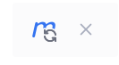
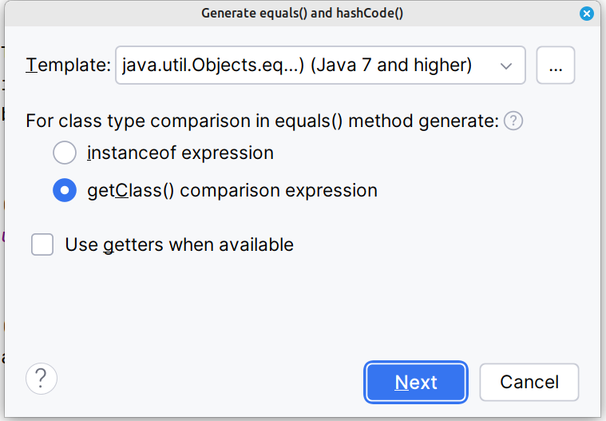
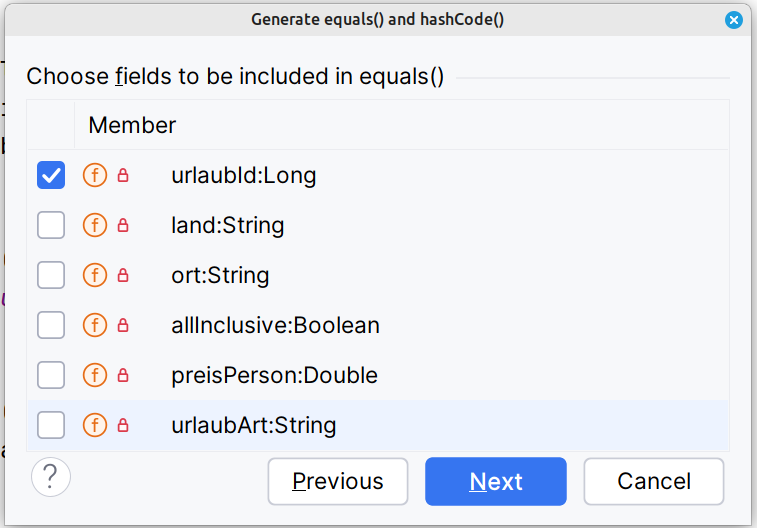
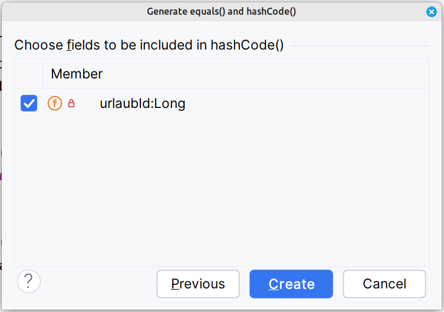

# JPA

JPA (Java Persistence API) ist die Verbindung zwischen Java-Klassen und einer Datenbank.

## @Entity

@Entity (aus jakarta.persistence.Entity) markiert eine Java-Klasse als persistente Entity.

Das bedeutet: Diese Klasse wird von JPA/Hibernate einer Datenbanktabelle zugeordnet.

Jede Instanz der Klasse entspricht einem Datensatz (Row) in der Tabelle.

## @Id

Kommt aus jakarta.persistence.Id (früher javax.persistence.Id).

Markiert das Primärschlüssel-Feld einer Entity.

Die Id benötigen wir dann später beim Löschen und Ändern.

```
@Entity
public class Urlaub {
    @Id
    private Long urlaubId;
}
```

## Generate Id

```
    private static final AtomicLong sequence = new AtomicLong(1000);

    public void setUrlaubId() {
        this.urlaubId = sequence.getAndIncrement();
    }
```

Keine Prüfung über die setMethode!

## Eigenschaften

Wie gewohnt. Aber verwenden Sie die Wrapper-Klassen.

```
    private String  land;
    private String  ort;
    private Boolean allInclusive;
    private Double  preisPerson;
    private String  uralubsArt;
```

## Lombok

Project Lombok ist eine Java-Bibliothek, die dir viel Boilerplate-Code (also lästigen Standardcode) abnimmt.

Durch spezielle Annotationen generiert Lombok beim Kompilieren automatisch Methoden wie:
- Getter / Setter
- equals() / hashCode()
- toString()
- Konstruktoren
- Logger

Das spart Zeit und macht Klassen viel übersichtlicher.

https://projectlombok.org/api

### pom.xml

```
        <dependency>
            <groupId>org.projectlombok</groupId>
            <artifactId>lombok</artifactId>
            <version>1.18.38</version>
            <scope>provided</scope>
        </dependency>
```

<br/>

### get set toString

```
@Getter
@Setter
@ToString
// @NoArgsConstructor
// @AllArgsConstructor
// @EqualsAndHashCode(of = "id", callSuper = false)
public class Urlaub {
```

### Constructor

```
    public Urlaub() {
    }

    public Urlaub(Long urlaubId, String land, String ort, Boolean allInclusive, Double preisPerson, String urlaubArt) {
        setUrlaubId (urlaubId);
        setLand (land);
        setOrt (ort);
        setAllInclusive (allInclusive);
        setPreisPerson (preisPerson);
        setUrlaubArt (urlaubArt);
    }

    public Urlaub(String land, String ort, Boolean allInclusive, Double preisPerson, String urlaubArt) {
        setUrlaubId ();
        setLand (land);
        setOrt (ort);
        setAllInclusive (allInclusive);
        setPreisPerson (preisPerson);
        setUrlaubArt (urlaubArt);
    }
```

### equals und hashCode

equals wird benutzt, um zwei Objekte auf inhaltliche Gleichheit zu prüfen.
Standardmäßig (von Object) prüft equals(), ob zwei Referenzen auf dasselbe Objekt im Speicher zeigen.
Oft wollen wir aber prüfen, ob zwei Objekte gleiche Werte haben, auch wenn es unterschiedliche Instanzen sind.

```
    @Override
    public boolean equals(Object o) {
        if (o == null || getClass() != o.getClass())
            return false;
        Urlaub urlaub = (Urlaub) o;
        return Objects.equals(urlaubId, urlaub.urlaubId);
    }
```

hashCode() liefert eine Ganzzahl (int) zurück, die ein Objekt repräsentiert.
Sie wird vor allem in Hash-basierten Collections wie HashMap, HashSet, Hashtable verwendet.
Der Hashcode bestimmt, in welchem „Bucket“ ein Objekt in der Hash-Struktur abgelegt wird.
Man kann sich das wie ein „Adressaufkleber“ vorstellen, der sagt, wo das Objekt in der Datenstruktur hingehört.

```
    @Override
    public int hashCode() {
        return Objects.hashCode(urlaubId);
    }
```

<br/>
<br/>
<br/>

### clone

clone() dient dazu, eine Kopie eines Objekts zu erstellen.
Standardmäßig macht sie nur eine flache Kopie („shallow copy“) → also Felder werden kopiert, aber Referenzen zeigen auf die gleichen Objekte.

```
    @Override
    public Urlaub clone() {
        Urlaub clone;
        clone = new Urlaub(urlaubId, land, ort, allInclusive, preisPerson, urlaubArt);
        return clone;
    }
```
