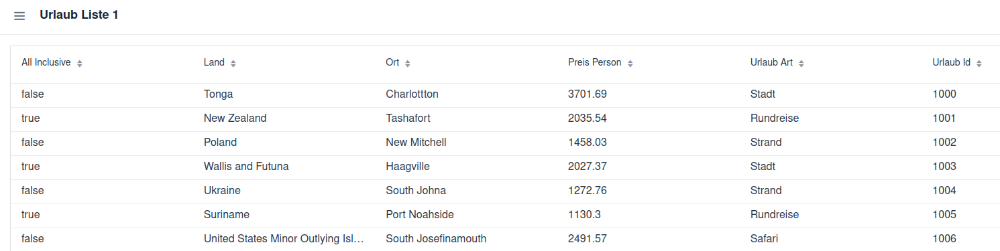

# Grid

Grid<T> ist eine Tabellen-Komponente in Vaadin, um eine Liste von Objekten übersichtlich darzustellen.

Jeder Datensatz wird als Zeile, jedes Attribut als Spalte angezeigt.

Du kannst Spalten automatisch generieren oder gezielt definieren.

```
    private final Grid<Urlaub> grid = new Grid<>(Urlaub.class, true);
```

## Service

```
    public ArrayList<Urlaub> findAll() {
        ArrayList<Urlaub> copy = new ArrayList<>(data);
        return copy;
    }
```
macht keine Deep Copy, sondern nur eine Shallow Copy (flache Kopie).

Ausführung:
- Es wird eine neue ArrayList angelegt.
- Alle Referenzen aus data werden in die neue Liste kopiert.
- Das heißt: Die Liste selbst ist neu, aber die Objekte vom Typ Urlaub sind dieselben wie vorher.

## UrlaubListe

```
public class UrlaubListe1  extends VerticalLayout {
    private final Grid<Urlaub> grid = new Grid<>(Urlaub.class, true);
    private final UrlaubService urlaubService;

    public UrlaubListe1(@Autowired UrlaubService urlaubService) {
        this.urlaubService = urlaubService;
        init();
    }
```

Es wird eine Instanz von UrlaubService als Eigenschaft gespeichert.

Das Service (UrlaubService) wurde automatisch mit @Autowired in die View instanziiert.

```
    private void init() {
        setSizeFull();
        grid.setSizeFull();
        add(grid);
        reload();
    }

    private void reload() {
        grid.setItems(urlaubService.findAll());
    }
```

<br/>
