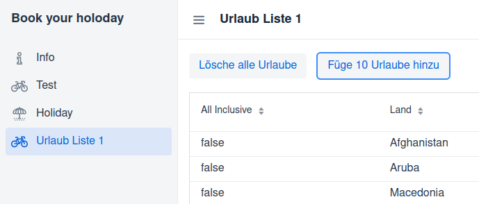

# Buttons



## Eigenschaft

```
public class UrlaubListe1  extends VerticalLayout {
    private Button buttonRemoveAll;
    private Button buttonAdd10;
```

Die Komponenten werden als Eigenschaft definiert.

## Hinzufügen

```
    private void init() {
        buttonRemoveAll = new Button("Lösche alle Urlaube");
        buttonAdd10     = new Button("Füge 10 Urlaube hinzu");
        add(new HorizontalLayout(buttonRemoveAll, buttonAdd10), grid);
    }
```

Die beiden Buttons werden instanziert und dem Layout hinzugefügt.

## Event

```
    private void init() {
        buttonRemoveAll = new Button("Lösche alle Urlaube");
        buttonRemoveAll.addClickListener(new ComponentEventListener<ClickEvent<Button>>() {
            @Override
            public void onComponentEvent(ClickEvent<Button> buttonClickEvent) {
                removeAllUrlaub();
            }
        });

        buttonAdd10     = new Button("Füge 10 Urlaube hinzu", buttonClickEvent -> add10Urlaub());
        add(new HorizontalLayout(buttonRemoveAll, buttonAdd10), grid);
    }
```

Die erste Variante zeigt das Event-Handling mit einer anonymen Klasse. Es wird die Methode removeAllUrlaub aufgerufen. Diese ist noch zu implementieren!

Die zweite Variante zeigt eine kurze Schreibweise mit Hilfe einer Lambda Expression. Auch hier wird die Methode add10Urlaub aufgerufen. Es ist eine kürzere Schreibweise.

## Abarbeitung

```
    private void removeAllUrlaub() {
        urlaubService.removeAll();
        reload();
    }

    private void add10Urlaub() {
        urlaubService.fillTestData(10);
        reload();
    }
```

Ein einfacher Methodenaufruf der Service Klasse.

## Service Klasse

```
    public void removeAll() {
        data.removeAll(data);
    }
    
    public void fillTestData(int anz) {
        ...
        faker = new Faker();
        for (int i=0; i<anz; i++) {
            u = new Urlaub(...);
            data.add(u);
        }
    }
```

Hier wird die Collection verändert.