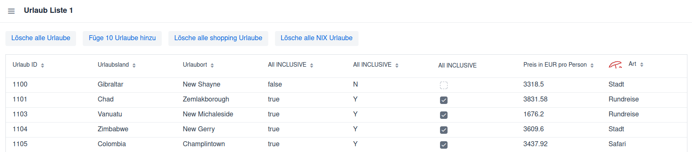
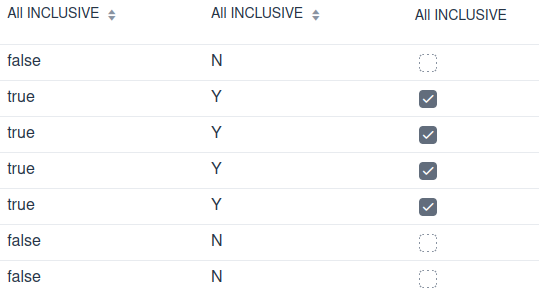
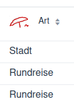

# Buttons



## Exception

```
    private final Grid<Urlaub> grid = new Grid<>(Urlaub.class, false);
```

autoCreateColumn = false

Dem grid werden die Spalten nicht automatisch zugewiesen.

## Varianten

```
        grid.addColumn(new ValueProvider<Urlaub, Long>() {
            @Override
            public Long apply(Urlaub urlaub) {
                return urlaub.getUrlaubId();
            }
        })
           .setHeader("Urlaub ID")
           .setSortable(true);
        
        grid.addColumn(urlaub -> urlaub.getLand())
                .setHeader("Urlaubsland")
                .setSortable(true);

        grid.addColumn(Urlaub::getOrt)
                .setHeader("Urlaubort")
                .setSortable(true);
```

Variante 1 - mit anonymer Klasse:
- Alte Schreibweise, bevor Java Lambdas hatte.
- Man schreibt eine anonyme Klasse, die ValueProvider<T, R> implementiert und die apply(...)-Methode überschreibt.
- Sehr ausführlich, aber am kompatibelsten (funktioniert auch in alten Java-Versionen < 8).
- Die Komponenten werden als Eigenschaft definiert.

Variante 2 - mit Lambda:
- Kürzer, moderner: urlaub -> urlaub.getLand() ist ein Lambda-Ausdruck.
- Funktional identisch mit Variante 1.
- Lesbarer und weniger Boilerplate.

Variante 3 - mit Method Reference:
- Noch kürzer: nutzt eine Methodenreferenz (Urlaub::getOrt).
- Automatisch dasselbe wie urlaub -> urlaub.getOrt().
- Am saubersten und übersichtlichsten, solange die Methode direkt aufgerufen werden kann.

## Boolean Feld

```
        grid.addColumn(Urlaub::getAllInclusive)
                .setHeader("All INCLUSIVE")
                .setSortable(true);

        grid.addColumn(urlaub -> {return urlaub.getAllInclusive() ? "Y":"N"; })
                .setHeader("All INCLUSIVE")
                .setSortable(true);

        grid.addComponentColumn(new ValueProvider<Urlaub, Component>() {
            @Override
            public Component apply(Urlaub urlaub) {
                Checkbox cb;
                cb = new Checkbox(urlaub.getAllInclusive().booleanValue());
                cb.setReadOnly(true);
                return cb;
            }
        })
                .setHeader("All INCLUSIVE")
                .setSortable(false);
```

Die erste Variante liefer true/false.
Die zweite Variante prüft mit einer if Abfrage und liefert "Y"/"N".
Die dritte Variante liefert eine CheckBox. Diese Variante ist nicht sortierbar!



## Titel mit Pic

```
        HorizontalLayout header = new HorizontalLayout();
        Image icon = new Image("images/logo_sm.png", "Icon");
        icon.setWidth("32px");
        Span text = new Span("Art");
        header.add(icon, text);
        grid.addColumn(Urlaub::getUrlaubArt).setHeader(header).setSortable(true);
```

Der header beinhaltet sowohl ein Bild als auch einen Text. Dazu wird wieder das HorizontalLayout verwendet.


