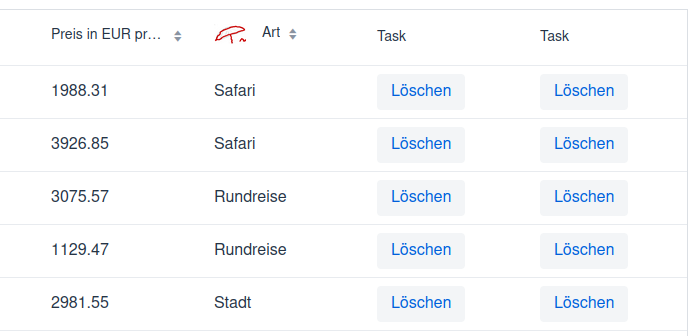

# Löschen



Löscht den Datensatz aus der Collection.

## Button ohne Funktionalität

```
       grid.addComponentColumn(new ValueProvider<Urlaub, Component>() {
            @Override
            public Component apply(Urlaub urlaub) {
                return new Button("Löschen");
            }
        })
                .setHeader("Task")
                .setSortable(false);
```

Fügt einen neuen Button hinzu und liefert diesen als Component zurück.

## Service

```
    public void removeUrlaubId2(Long urlaubId) throws UrlaubException {
        Urlaub u;
        Iterator<Urlaub> it;
        int anz;

        anz = 0;
        if (urlaubId == null)
            throw new UrlaubException("Fehler: keine UrlaubsID angegeben!");
        it = data.iterator();
        while (it.hasNext()) {
            u = it.next();
            if (u.getUrlaubId().equals(urlaubId)) {
                it.remove();
                anz++;
            }
        }
        if (anz == 0)
            throw new UrlaubException("Fehler: Datensatz nicht mehr vorhanden!");
    }
```

Ausführliche Implementierung für das Löschen mit Hilfe der ID.

```
    public void removeUrlaubId(Long urlaubId) throws UrlaubException {
        if (urlaubId == null)
            throw new UrlaubException("Fehler: keine UrlaubsID angegeben!");
        if (!this.data.removeIf(entity -> urlaubId.equals(entity.getUrlaubId())))
            throw new UrlaubException("Fehler: Datensatz nicht mehr vorhanden!");
    }
```

Kurze Variante.

Beide Varianten liefern eine Exception im Fehlerfall.

## Event

```
        grid.addComponentColumn(new ValueProvider<Urlaub, Component>() {
            @Override
            public Component apply(Urlaub urlaub) {
                return new Button("Löschen", e -> removeSelected(urlaub.getUrlaubId()));
            }
        })
                .setHeader("Task")
                .setSortable(false);
```

Beim drücken des Buttons wird die Methode removeSelected aufgerufen. Dabei wird als Parameter die ID übergeben.

## removeSelected

```
    private void removeSelected(Long urlaubId) {
        try {
            urlaubService.removeUrlaubId(urlaubId);
            reload();
        }
        catch (UrlaubException e) {
            Notification.show(e.getMessage());
        }
        catch (Exception e) {
            Notification.show(e.getMessage());
        }
    }
```

Aufruf der Methode in der Service Klasse.